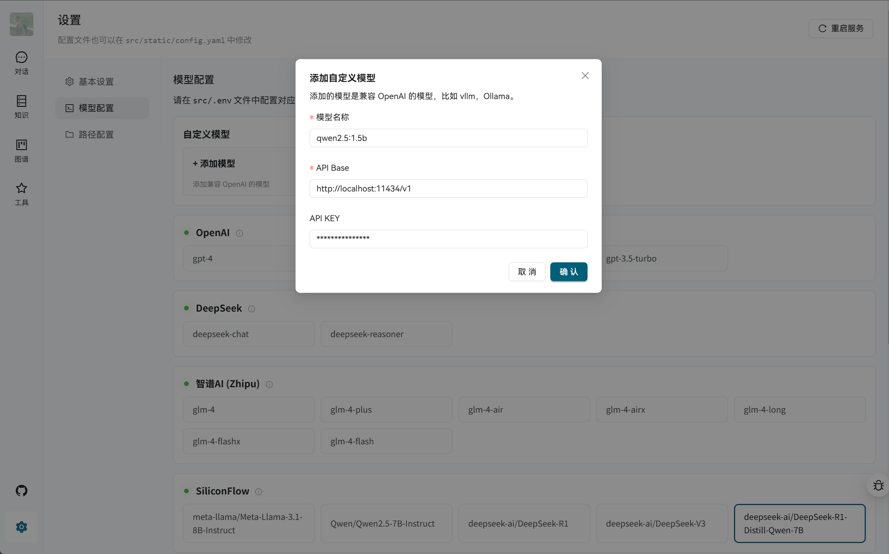

<h1 align="center">语析 - 基于大模型的知识库与知识图谱问答系统</h1>
<div align="center">


</div>

## 📝 项目概述

语析是一个强大的问答平台，结合了大模型 RAG 知识库与知识图谱技术，基于 Llamaindex + VueJS + FastAPI + Neo4j 构建。

**核心特点：**

- 🤖 多模型支持：适配 OpenAI、各大国内主流大模型平台，以及本地 vllm、ollama 部署
- 📚 灵活知识库：支持 PDF、TXT、MD 等多种格式文档
- 🕸️ 知识图谱集成：基于 Neo4j 的知识图谱问答能力
- 🚀 简单配置：只需配置对应服务平台的 `API_KEY` 即可使用
- 🤖 智能体拓展：可以编写自己的智能体代码（Dev过程，非正式版）


## 📋 更新日志

- **2025.03.30** - 系统中集成智能体（WIP， [PR#96](https://github.com/xerrors/Yuxi-Know/pull/96)）
- **2025.02.24** - 新增网页检索以及内容展示，需配置 `TAVILY_API_KEY`，感谢 [littlewwwhite](https://github.com/littlewwwhite)
- **2025.02.23** - SiliconFlow 的 Rerank 和 Embedding model 支持，现默认使用 SiliconFlow
- **2025.02.20** - DeepSeek-R1 支持，需配置 `DEEPSEEK_API_KEY` 或 `SILICONFLOW_API_KEY`
- **2024.10.12** - 后端修改为 [FastAPI](https://github.com/fastapi)，添加 [Milvus-Standalone](https://github.com/milvus-io) 独立部署


| PC 网页                                                                                 | 小屏设备                                                                                |
| :-------------------------------------------------------------------------------------- | :-------------------------------------------------------------------------------------- |
|  |  |

### 环境配置

在启动前，您需要提供 API 服务商的 API_KEY，并放置在 `src/.env` 文件中（此文件项目中没有，需要自行参考 [src/.env.template](src/.env.template) 创建）。更多可配置项，可参考 后面**对话模型**部分。

默认使用硅基流动的服务，因此**必须**配置：

```
SILICONFLOW_API_KEY=sk-270ea********8bfa97.e3XOMd****Q1Sk
OPENAI_API_KEY=<API_KEY> # 如果需要配置 openai 则添加此行，并替换 API_KEY
DEEPSEEK_API_KEY=<API_KEY>  # 如果配置 DeepSeek 添加此行，并替换 API_KEY
ZHIPUAI_API_KEY=<API_KEY>  # 如果配置 智谱清言 添加此行，并替换 API_KEY
```

需要确保账户有一点点额度供调用，或使用这个链接注册[SiliconFlow 注册（含邀请码）](https://cloud.siliconflow.cn/i/Eo5yTHGJ)获得 14 元的赠送额度。

> 本项目的基础对话服务可在不含显卡的设备上运行，大模型使用在线服务商的接口。

### 启动服务

**开发环境启动**（源代码修改会自动更新）：

```bash
docker compose -f docker/docker-compose.dev.yml --env-file src/.env up --build
```

> 添加 `-d` 参数可在后台运行


成功启动后，会看到以下容器：

```
[+] Running 7/7
 ✔ Network docker_app-network       Created
 ✔ Container graph-dev              Started
 ✔ Container milvus-etcd-dev        Started
 ✔ Container milvus-minio-dev       Started
 ✔ Container milvus-standalone-dev  Started
 ✔ Container api-dev                Started
 ✔ Container web-dev                Started
```

访问 [http://localhost:5173/](http://localhost:5173/) 即可使用系统。

### 系统预览


问答支持 Deepseek-R1 等推理模型、知识图谱检索、知识库检索、网页检索


网页检索结果：


知识图谱检索结果：


知识库检索结果


知识库管理：


知识图谱


可视化配置：


丰富的模型支持：


### 服务管理

**关闭服务**：

```bash
docker compose -f docker/docker-compose.dev.yml --env-file src/.env down
```

**查看日志**：

```bash
docker logs <容器名称>  # 例如：docker logs api-dev
```

## 💻 模型支持

### 1. 对话模型

本项目支持通过 API 调用的模型，本地模型需使用 vllm、ollama 转成 API 服务后使用。

| 模型供应商             | 默认模型                            | 配置项目                                       |
| :--------------------- | :---------------------------------- | :--------------------------------------------- |
| `siliconflow` (默认) | `Qwen/Qwen2.5-7B-Instruct` (免费) | `SILICONFLOW_API_KEY`                        |
| `openai`             | `gpt-4o`                          | `OPENAI_API_KEY`                             |
| `deepseek`           | `deepseek-chat`                   | `DEEPSEEK_API_KEY`                           |
| `arc`（豆包方舟）    | `doubao-1-5-pro-32k-250115`       | `ARK_API_KEY`                                |
| `zhipu`（智谱清言）  | `glm-4-flash`                     | `ZHIPUAI_API_KEY`                            |
| `dashscope`（阿里）  | `qwen-max-latest`                 | `DASHSCOPE_API_KEY`                          |

#### 添加新模型供应商

如需添加供应商模型，了解 OpenAI 调用方法后，只需在 [src/static/models.yaml](src/static/models.yaml) 中添加对应配置：

```yaml
ark:
  name: 豆包（Ark）
  url: https://console.volcengine.com/ark/region:ark+cn-beijing/model # 模型列表
  default: doubao-1-5-pro-32k-250115 # 默认模型
  base_url: https://ark.cn-beijing.volces.com/api/v3
  env:  # 需要配置的环境变量，仅限API key
    - ARK_API_KEY
  models:
    - doubao-1-5-pro-32k-250115
    - doubao-1-5-lite-32k-250115
    - deepseek-r1-250120
```

#### 本地模型部署

支持添加以 OpenAI 兼容模式运行的本地模型，可在 Web 设置中直接添加（适用于 vllm 和 Ollama 等）。

> [!注意]
> 使用 docker 运行此项目时，ollama 或 vllm 需监听 `0.0.0.0`



### 2. 向量模型与重排序模型

建议使用硅基流动部署的 bge-m3（免费且无需修改）。其他模型配置参考 [src/static/models.yaml](src/static/models.yaml)。

对于**向量模型**和**重排序模型**，选择 `local` 前缀的模型会自动下载。如遇下载问题，请参考 [HF-Mirror](https://hf-mirror.com/) 配置。

要使用已下载的本地模型，可在 models.yaml 或者网页设置中映射。


**添加向量模型**

```yaml
# src/static/models.yaml
  # 添加本地向量模型（所有 FlagEmbedding 支持的模型）
  local/BAAI/bge-m3:
    name: BAAI/bge-m3
    dimension: 1024
    # local_path: /models/BAAI/bge-m3，也可以在这里配置

  # 添加 OpenAI 兼容的向量模型
  siliconflow/BAAI/bge-m3:
    name: BAAI/bge-m3
    dimension: 1024
    url: https://api.siliconflow.cn/v1/embeddings
    api_key: SILICONFLOW_API_KEY

  # 添加 Ollama 模型
  ollama/nomic-embed-text:
    name: nomic-embed-text
    dimension: 768
```

## 📚 知识库支持

本项目支持多种格式的知识库文件：

- PDF
- Txt
- Markdown
- Docx

文件上传后，系统会：

1. 将文件转换为纯文本
2. 使用向量模型将文本转换为向量
3. 存储到向量数据库中

> 此过程可能需要一定时间，请耐心等待。

## 🕸️ 知识图谱支持

本项目使用 Neo4j 作为知识图谱存储。您需要将图谱整理成 jsonl 格式，每行格式为：

```
{"h": "北京", "t": "中国", "r": "首都"}
```

然后在网页的图谱管理中添加此文件。

> [!说明]
> 现阶段项目使用的 OneKE 自动创建知识图谱效果不佳，已暂时移除，建议在项目外创建知识图谱

系统启动后会自动启动 neo4j 服务：

- 访问地址：[http://localhost:7474/](http://localhost:7474/)
- 默认账户：`neo4j`
- 默认密码：`0123456789`

可在 `docker/docker-compose.yml` 和 `docker/docker-compose.dev.yml` 中修改配置（注意同时修改 `api.environment` 和 `graph.environment`）。

目前项目暂不支持同时查询多个知识图谱。如已有基于 neo4j 的知识图谱，可删除 `docker-compose.yml` 中的 `graph` 配置项，并修改 `api.environment` 中的 `NEO4J_URI` 为您的 neo4j 服务地址。同时，需要确保节点的标签中包含 Entity 标签，才能正常触发索引。

## 贡献者名单

感谢以下贡献者的支持！

<a href="https://github.com/xerrors/Yuxi-Know/contributors">
    
</a>

## ❓ 常见问题

### 镜像下载问题

如无法直接下载相关镜像，可参考 [DaoCloud/public-image-mirror](https://github.com/DaoCloud/public-image-mirror?tab=readme-ov-file#%E5%BF%AB%E9%80%9F%E5%BC%80%E5%A7%8B)，尝试替换前缀：

```bash
# 以 neo4j 为例，其余类似
docker pull m.daocloud.io/docker.io/library/neo4j:latest

# 然后重命名镜像
docker tag m.daocloud.io/docker.io/library/neo4j:latest neo4j:latest
```

## Star History

[](https://star-history.com/#xerrors/Yuxi-Know)
