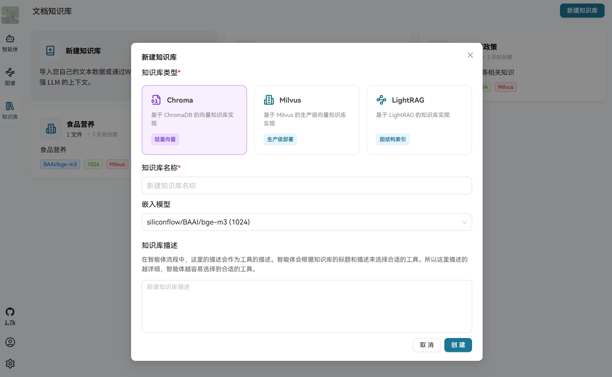
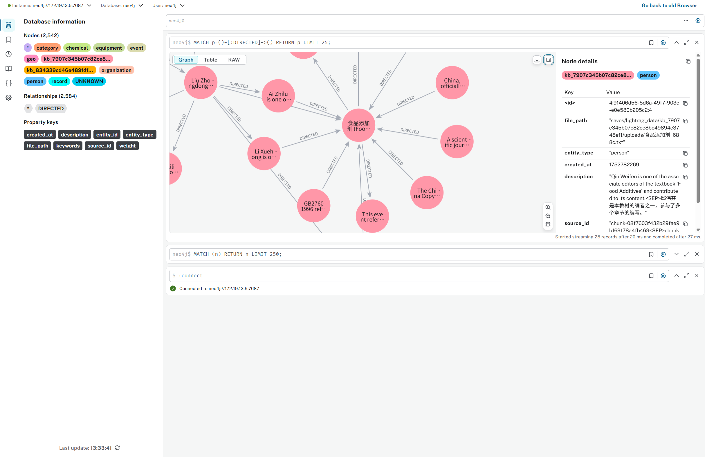

<h1 align="center">语析 - 基于大模型的知识库与知识图谱问答系统</h1>

<div align="center">

[](https://github.com/xerrors/Yuxi-Know/issues)
[](https://github.com/xerrors/Yuxi-Know/blob/main/docker-compose.yml)
[](https://github.com/xerrors/Yuxi-Know/issues)
[](https://github.com/xerrors/Yuxi-Know/blob/main/LICENSE)
[](https://deepwiki.com/xerrors/Yuxi-Know)
[](https://www.bilibili.com/video/BV1ETedzREgY/?share_source=copy_web&vd_source=37b0bdbf95b72ea38b2dc959cfadc4d8)


</div>


## 📖 简介

语析是一个功能强大的智能问答平台，融合了 RAG 知识库与知识图谱技术，基于 LangGraph + Vue.js + FastAPI + LightRAG 架构构建。

### ✨ 核心特性

- 🤖 **多模型支持** - 适配主流大模型平台及本地部署（vLLM、Ollama），支持自定义智能体开发，兼容 LangGraph 部署
- 📚 **灵活知识库** - 支持 LightRAG、Milvus、Chroma 等存储形式，配置 MinerU、PP-Structure-V3 的文档解析引擎
- 🕸️ **知识图谱** - 支持 LightRAG 的自动图谱构建，以及自定义图谱问答，可接入现有知识图谱
- 👥 **权限控制** - 支持超级管理员、管理员、普通用户三级权限体系

<div align="center">
  <!-- 视频缩略图 -->
  <a href="https://www.bilibili.com/video/BV1ETedzREgY/?share_source=copy_web&vd_source=37b0bdbf95b72ea38b2dc959cfadc4d8" target="_blank">
    
  </a>
  
  <!-- 视频链接文字 -->
  <p style="margin-top: 12px;">
    <a href="https://www.bilibili.com/video/BV1ETedzREgY/?share_source=copy_web&vd_source=37b0bdbf95b72ea38b2dc959cfadc4d8" target="_blank" style="text-decoration: none; color: #23ade5; font-weight: 500;">
      📽️ 点击查看视频演示 <i class="fa fa-external-link" style="margin-left: 4px;"></i>
    </a>
  </p>
</div>


## 🚀 快速开始

### 系统要求

项目本身不需要显卡支持，可以运行在任何设备上。对于模型推理或者文档解析服务都可以和项目本身解耦，通过环境变量配置对应的服务即可。同时项目也提供了本地部署基于 vllm 的脚本。

### 一键启动

1. **克隆项目**
   ```bash
   git clone -b 0.2.0.preview https://github.com/xerrors/Yuxi-Know.git
   cd Yuxi-Know
   ```
   如果想要使用之前的稳定版，可以使用分支：`stable` 分支，`main` 分支是最新的开发版本。

2. **配置 API 密钥**

   复制环境变量模板并编辑：
   ```bash
   cp src/.env.template src/.env
   ```

   **必需配置**（推荐使用硅基流动免费服务）：
   ```env
   SILICONFLOW_API_KEY=sk-270ea********8bfa97.e3XOMd****Q1Sk
   ```
   > 💡 [免费获取 SiliconFlow API Key](https://cloud.siliconflow.cn/i/Eo5yTHGJ)（注册即送 14 元额度）
   > 💡 [免费获取 智谱 API Key](https://www.bigmodel.cn/invite?icode=6BruxYJDdROL5pQX%2FOeYvA%3D%3D)（注册即送 2000 万Tokens，限 GLM-4.5-air）

3. **启动服务**
   ```bash
   docker compose up --build
   ```

   添加 `-d` 参数可后台运行。启动完成后访问：[http://localhost:5173](http://localhost:5173)

4. **停止服务**
   ```bash
   docker compose down
   ```

### 故障排除

如果 docker 已经正常启动，则使用 `docker logs api-dev -f` 查看后端日志。

<details>
  <summary>Docker 镜像拉取失败</summary>

如果拉取镜像失败，可以尝试手动拉取：

```bash
  bash docker/pull_image.sh python:3.11-slim  # 替换后面的 repo_name 即可
  ```
  **如果**依然存在镜像拉取问题，可以先在另一个可访问 Docker 的设备上拉取镜像后，使用下面的脚本保存为 tar 文件，再拷贝到开发设备使用。
  ```bash
  # 保存镜像，会生成 docker_images_xxx.tar
  bash docker/save_docker_images.sh # Linux 或 macOS
  powershell -ExecutionPolicy Bypass -File docker/save_docker_images.ps1 # Windows PowerShell

  # 拷贝 docker_images_xxx.tar 文件到开发设备
  scp docker_images_xxx.tar <user>@<dev_host>:<path_to_save>

  # 在开发设备上执行
  docker load -i docker_images_xxx.tar
   ```
</details>
<details>
  <summary>镜像拉取完成，但是构建失败</summary>

如果拉取镜像完成，但是构建失败，基本都是因为依赖的镜像问题，可以在环境变量中配置如下。如果是已经配置了代理，但是构建失败，也可以尝试移除代理后重试。

```bash
export HTTP_PROXY=http://IP:PORT
export HTTPS_PROXY=http://IP:PORT
```
</details>

<details>
  <summary>Milvus 启动失败，执行 `docker compose up milvus -d && docker restart api-dev`</summary>
</details>


## 🤖 模型配置

### 对话模型

支持多种 API 服务商，配置对应的 `API_KEY` 即可使用：
| 服务商 | 环境变量 | 备注 |
|--------|----------|------|
| 硅基流动 | `SILICONFLOW_API_KEY` | 🆓 免费，默认 |
| OpenAI | `OPENAI_API_KEY` | |
| DeepSeek | `DEEPSEEK_API_KEY` | |
| OpenRouter | `OPENROUTER_API_KEY` | |
| 智谱清言 | `ZHIPUAI_API_KEY` | |
| 阿里云百炼 | `DASHSCOPE_API_KEY` | |

<details>
  <summary>自定义模型供应商</summary>

在 [src/static/models.yaml](src/static/models.yaml) 中添加新的模型配置，然后在 `.env` 文件中添加对应的环境变量，最后重新部署项目即可。

**示例**：

```yaml
custom-provider-name-here:
  name: custom-provider-name-here
  default: custom-model-name-here
  base_url: "https://api.your-provider.com/v1"
  env:
    - CUSTOM_API_KEY_ENV_NAME  # e.g. OPENAI_API_KEY
  models:
    - supported-model-name-here
```
</details>

### OpenAI 兼容模型

项目理论上兼容任何 OpenAI 兼容的模型，包括但不限于 vLLM、Ollama 或者其他 API 中转或者代理服务。在 Web 界面的"设置"中添加本地模型地址。


## 📚 功能详解

### 知识库管理

现在支持的知识库类型包括 `Chroma`、`Milvus`、`LightRAG`。[LightRAG](https://github.com/HKUDS/LightRAG) 是轻量级 GraphRAG方法。



### 知识图谱

在 v0.2 版本中，项目支持了基于 [LightRAG](https://github.com/HKUDS/LightRAG) 的知识图谱构建方法。需要在知识库中创建一个基于 LightRAG 的知识库，然后上传文档。构建的知识图谱会自动导入到 Neo4j 中，并使用不同的 label 做区分。需要说明的是，基于 LightRAG 的知识库，可以在知识库详情中可视化，但是不能在侧边栏的图谱中检索，知识图谱检索工具也不支持基于 LightRAG 的知识库进行检索。基于 LightRAG 方法构建的图谱的查询，需要使用对应的知识库作为查询工具。

默认使用的图谱构建模式是 `siliconflow` 的 `Qwen/Qwen3-30B-A3B-Instruct-2507`，可以使用 `LIGHTRAG_LLM_PROVIDER` 和 `LIGHTRAG_LLM_NAME` 覆盖。

|知识库可视化|Neo4J管理端|
|--|--|
|||

除此之外，也支持将已有的知识图谱按照下面的格式导入 Neo4j 中，上传后，节点会自动添加 `Upload`、`Entity` 标签，关系会自动添加 `Relation` 标签。可以通过 `name` 属性访问实体的名称，使用 `type` 属性访问边的名称。默认账户密码是`neo4j` / `0123456789`。


**数据格式**：支持 JSONL 格式导入，可以先尝试 [test/data/A_Dream_of_Red_Mansions_tiny.jsonl](test/data/A_Dream_of_Red_Mansions_tiny.jsonl) 文件。

```jsonl
{"h": "北京", "t": "中国", "r": "首都"}
{"h": "上海", "t": "中国", "r": "直辖市"}
```

此外，也可以通过修改 `docker-compose.yml` 中的 `NEO4J_URI` 配置来接入已有的 Neo4j 实例，**但是**最好确保每个节点都有 Entity 标签，每个关系都有 `RELATION` 类型，否则会影响到图的检索与构建。

注：在“图谱”页面，只能看到上传的节点和边，基于 LightRAG 构建的图谱不会展示在里面，完整的图谱可以去 Neo4j 管理页面查看。

## 🔧 高级配置

### OCR 服务（可选）

对于**基础的 OCR 服务**（RapidOCR onnx 版本），可以使用 SWHL/RapidOCR 的 onnx 版本，但是需要提前将模型下载到 `$MODEL_DIR` 目录下（默认 `src/.env.template` 中为 `models`）。在容器内实际路径为 `/models`（由 `MODEL_DIR_IN_DOCKER` 指向）。

```bash
huggingface-cli download SWHL/RapidOCR --local-dir ${MODEL_DIR:-./models}/SWHL/RapidOCR
```

- 模型完整性要求：需要存在 `PP-OCRv4/ch_PP-OCRv4_det_infer.onnx` 和 `PP-OCRv4/ch_PP-OCRv4_rec_infer.onnx`
- 如果提示 `[Errno 13] Permission denied` 则需要使用 sudo 修改权限之后再执行

提升 PDF 解析准确性，可以选择使用 MinerU 或 PP-Structure-V3 服务（需要 NVIDIA GPU）。

启用**MinerU**服务：

```bash
# MinerU（需要 CUDA 12.6+ 的 sglang 镜像）
docker compose up mineru --build
```

启用**PP-Structure-V3**服务，配置文件可在 [docker/PP-StructureV3.yaml](docker/PP-StructureV3.yaml) 中修改。

```bash
# PP-Structure-V3（需要 CUDA 11.8+）
docker compose up paddlex --build
```

### 自定义智能体应用开发

目前该项目默认集成了三个 Demo 智能体，包含基础智能体、ReAct、DeepResearch 三个案例 Demo，均使用 [LangGraph](https://github.com/langchain-ai/langgraph) 开发。代码位于 [src/agents](src/agents) 目录。在 [src/agents/react/graph.py](src/agents/react/graph.py) 中定义了 `ReActAgent` 示例。

如果需要自定义智能体应用，实现一个继承于 `BaseAgent` 的类，并实现 `get_graph` 方法返回一个 graph 实例。智能体的 `config_schema` 定义了配置参数，可继承 `Configuration` 定义。

注册智能体的方式请参考已有实现：[src/agents/__init__.py](src/agents/__init__.py)。例如：

```python
from .chatbot import ChatbotAgent

agent_manager = AgentManager()
agent_manager.register_agent(ChatbotAgent)
agent_manager.init_all_agents()
```

### 服务端口说明

| 端口 | 服务 | 说明 |
|------|------|------|
| 5173 | Web 前端 | 用户界面（容器名：web-dev） |
| 5050 | API 后端 | 核心服务（容器名：api-dev） |
| 7474/7687 | Neo4j | 图数据库（容器名：graph） |
| 9000/9001 | MinIO | 对象存储（容器名：milvus-minio） |
| 19530/9091 | Milvus | 向量数据库（容器名：milvus） |
| 30000 | MinerU | PDF 解析（容器名：mineru，可选）|
| 8080 | PaddleX | OCR 服务（容器名：paddlex-ocr，可选）|
| 8081 | vLLM | 本地推理（可选，scripts/vllm/run.sh 默认端口）|


### 品牌信息配置

在主页和登录页面的很多信息，比如 Logo，组织名称，版权信息等，都可以复制 [src/static/info.template.yaml](src/static/info.template.yaml)，并新建一个 `src/static/info.local.yaml`（或者在 .env 文件中配置 `YUXI_BRAND_FILE_PATH` 指向这个文件），在这个文件中配置。在项目启动时，会加载这个文件，然后根据文件中的配置，渲染到前端页面中。如果 `src/static/info.local.yaml` 不存在，会默认使用 [src/static/info.template.yaml](src/static/info.template.yaml) 中的配置。

系统的配色方面，主要保存在 [web/src/assets/css/base.css](web/src/assets/css/base.css) 中。只要替换其中的 `--main-*` 相关的变量，就可以改变系统的配色。

### 预设脚本

**文件上传脚本**，使用 `scripts/batch_upload.py` 脚本上传文件到知识库中，调用示例如下，会将 `path/to/your/data` 目录下所有 `*.docx` 文件上传到 `your_kb_id` 知识库中。

```bash
# 上传知识库文件
uv run scripts/batch_upload.py upload \
    --db-id your_kb_id \
    --directory path/to/your/data \
    --pattern "*.docx" \
    --base-url http://127.0.0.1:5050/api \
    --username your_username \
    --password your_password \
    --concurrency 4 \
    --recursive \
    --record-file scripts/tmp/batch_processed_files.txt
```

**文件解析脚本**，还可以使用 `scripts/batch_upload.py trans` 脚本将文件解析成 markdown 文件，调用示例如下，会将 `path/to/your/data` 目录下所有 `*.docx` 文件解析成 markdown 文件，输出到 `path/to/output_markdown` 目录中。

```bash
# 文件解析成 markdown
uv run scripts/batch_upload.py trans \
    --db-id your_kb_id \
    --directory path/to/your/data \
    --output-dir path/to/output_markdown \
    --pattern "*.docx" \
    --base-url http://127.0.0.1:5050/api \
    --username your_username \
    --password your_password \
    --concurrency 4 \
    --recursive
```

## ❓ 常见问题

- 如何查看后端日志？运行 `docker logs api-dev -f`
- RapidOCR 模型未找到怎么办？确认 `MODEL_DIR` 指向的目录存在 `SWHL/RapidOCR`，且包含 `PP-OCRv4` 下的 det/rec onnx 文件。
- MinerU/PaddleX 健康检查失败？分别检查 `http://localhost:30000/health` 与 `http://localhost:8080/` 是否 200，确认 GPU/驱动与 CUDA 版本匹配。

## 🤝 参与贡献

感谢所有贡献者的支持！

<a href="https://github.com/xerrors/Yuxi-Know/contributors">
    
</a>

### 如何贡献

1. Fork 本项目
2. 创建特性分支 (`git checkout -b feature/amazing-feature`)
3. 提交更改 (`git commit -m 'Add some amazing feature'`)
4. 推送到分支 (`git push origin feature/amazing-feature`)
5. 创建 Pull Request

## 📊 Star History

[](https://star-history.com/#xerrors/Yuxi-Know)

## 📄 许可证

本项目采用 MIT 许可证 - 查看 [LICENSE](LICENSE) 文件了解详情。

---

<div align="center">

**如果这个项目对您有帮助，请不要忘记给我们一个 ⭐️**

[报告问题](https://github.com/xerrors/Yuxi-Know/issues) | [功能请求](https://github.com/xerrors/Yuxi-Know/issues) | [讨论](https://github.com/xerrors/Yuxi-Know/discussions)

</div>
